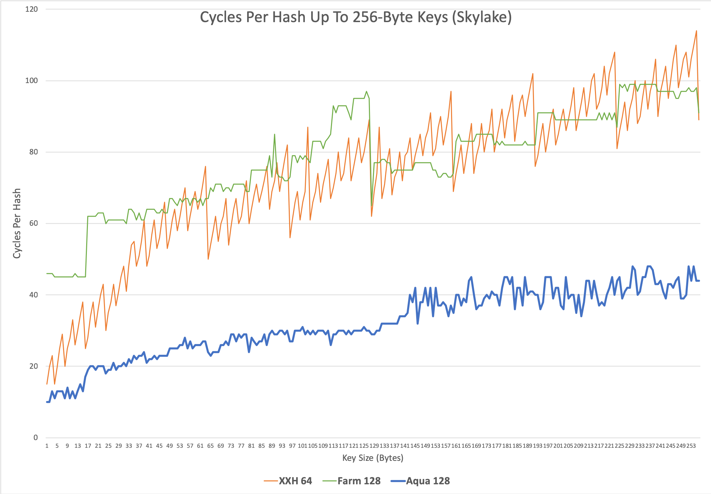

# AquaHash: Fast Hash Functions Using AES Intrinsics

AquaHash is a 128-bit non-cryptographic hash function that delivers state-of-the-art performance across all key sizes. The algorithm employs a novel construction based on AES intrinsics that are widely available on modern CPUs. More details of its design can be [found here](http://www.jandrewrogers.com/2019/03/06/aquahash/).

## Performance

The AquaHash algorithm substantially outperforms most common algorithms at all key sizes on modern CPUs. On Skylake CPUs, bulk hashing performance is an exceptional 15 bytes/cycle. Small key performance is nearly twice that of popular small key algorithms. Some reduction in relative performance is expected on older CPUs with slower AES intrinsics but should remain competitive due to the large differences in baseline performance.

The performance measurement below includes xxhash64 and Google's FarmHash, popular algorithms optimized for small keys and large keys respectively. Intel’s Skylake microarchitecture is used to measure all algorithms.

 

## Usage

The source is implemented as a single C++ header file "aquahash.h". Both incremental and non-incremental algorithm implementations are included. When use cases allow, it is preferable to use the non-incremental implementation because it will be significantly faster than incrementally constructing the hash.

### Non-Incremental Hashing

```
__m128i hash = AquaHash::Hash(uint8_t * key, size_t bytes, __m128i seed = _mm_setzero_si128());
```

### Incremental Hashing

```
AquaHash aqua(__m128i seed = _mm_setzero_si128());
aqua.Update(uint8_t * key, size_t bytes);
...
aqua.Update(uint8_t * key, size_t bytes);
__m128i hash = aqua.Finalize();
```

The incremental object can be re-initialized at any time using

```
aqua.Initialize(__m128i seed = _mm_setzero_si128());
```

## Current Status

**2019-03-06** Initial v1.0 release of the algorithm source code. Includes both incremental and non-incremental implementations, as well as reference implementations of the underlying large key and small key component algorithms. Test vectors and an implementation verification method are included.
